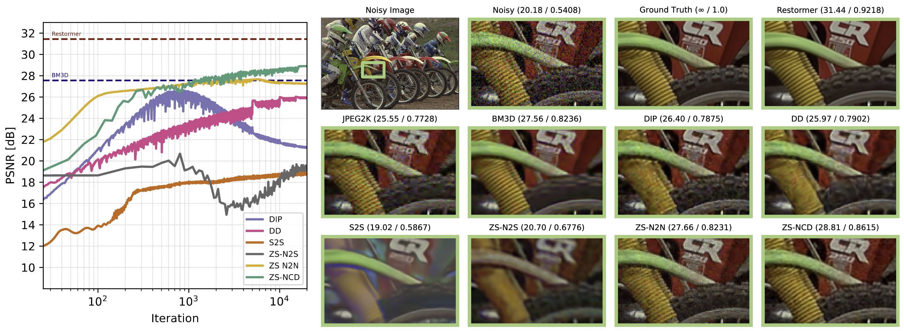

# Zero-Shot Denoising via Neural Compression (NeurIPS 2025 Spotlight)

This repository contains implementation of zero-shot denoising via neural compression : **ZS-NCD**

Ali Zafari*, Xi Chen* and Shirin Jalali. "Zero-shot Denoising via Neural Compression: Theoretical and Algorithmic Framework." Advances in Neural Information Processing Systems (NeurIPS 2025) [PDF](https://arxiv.org/pdf/2506.12693?)

## Initial Requirements

- Python > 3.11
- Jupyter Lab

## Getting Started

Follow the steps below in the directory where you have cloned this GitHub repository:

### 1. Set up a Virtual Environment

You can choose either a `conda` environment or a `venv`-based environment.

#### Option A: Using Conda (Recommended)

If you have `conda` installed, create and activate a new environment:

```bash
conda create -n zs-ncd python=3.11
conda activate zs-ncd
```

#### Option B: Using venv

If you prefer not to use `conda` (already have python > 3.11 installed):

```bash
python3 -m venv venv
source venv/bin/activate
```

For Windows, activate the virtual environment with:

```bash
venv\Scripts\activate
```

### 2. Install Jupyter Lab

#### Option A: Using Conda
```bash
conda install -c conda-forge jupyterlab
```

#### Option B: Using pip

```bash
pip install jupyterlab
```

### 3. Launch Jupyter Lab

```bash
jupyter lab
```

### 4. Install Additional Packages

Once inside the notebook, follow the instructions in the first set of cells to install the required dependencies. (For a full list of dependencies, see `requirements.txt`).

---

## Denoising via ZS-NCD

**Enjoy experimenting!** All instructions and examples can be found in the accompanying Jupyter notebook. 


## Zero-shot Denoisers at a Glance
For further discussion, refer to Figure 2 in the paper and the discussion therein.


Zero-shot denoising of *Kodim05* with AWGN (σ = 25). **Left**: PSNR versus training iterations for zero-shot denoisers. Performance of BM3D and Restormer are included as a classical baseline and as a supervised empirical upper bound, respectively. **Right**: Visual reconstructions with PSNR/SSIM above each image. Compression-based denoising based on JPEG2K achieves inferior performance. Learning-based zero-shot denoisers often struggle with either overfitting or high bias. DIP and DD require early stopping to avoid overfitting. ZS-N2S and S2S struggle with high-resolution color images, and ZS-N2N often produces noisy outputs with potential overfitting. BM3D tends to oversmooth the denoised image. In contrast, ZS-NCD avoids these issues.
